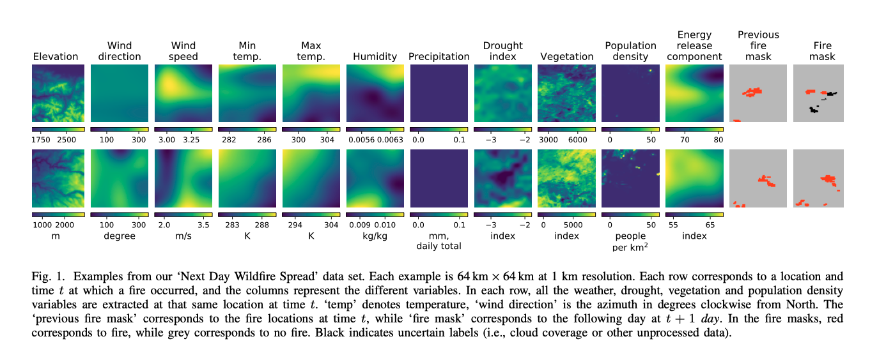
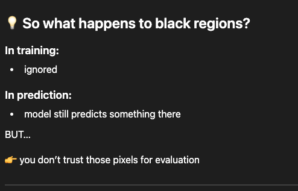
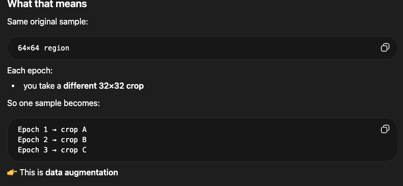

# Notes from original research paper 

- They used logisitic regression, and randon forest as baseline models 
- And for their main model they used convulution autoencoder.
    - So we can try something like CNN or Unet 

- This is for me to do later: 
    - compare different resolutions (advanced)
    - predict multi-day spread (hard)
    - analyze feature importance (good)
    - restrict to a region (like California)

## Features 
- 

- Elevation - how high the land is
    - slopes acclerate fire
    - fire moves faster uphill

- wind direction 
    - the wind direction determines the direction of the fire spread

- Wind speed
    - How strong the wind speed is affects how fast the fire will spread

- Max temp / min temp
    - The higher the temperature, the more aggresive the fire spreads

- humidity 
    - this measures how much mositure is in the air
    - high humidity means slows fire
    - Low humidity means fire spreads easily 

- Precipitation 
    - if it rained then wet fuel so less fire 
    - if it didnt rain then dry fuel so more fire

- Drought Index
    - This tells us how dry it has been 
    - so if it has been dry for a while then more likely for the fire to spread more aggressivley 

- NDVI (Vegetation Index)
    - Measure how much vegatation there is
    - more vegetation, the more flammable it is

- ERC (Energy Release Component)
    - it combines multiple fuel and mositure factors 
    - higher ERC = more intense fire potential

- Population Density
    - How many people are nearby
    - This fetature is not for fire spreading but where the fire starts
    - People tend to start fires so the more people, the higher the fire ignation rate it

- Previous mask
    - where the fire is at day t

- Target: Fire Mask
    - This is what we will be predicting, where the fire will be at day t+

## Data aggregation 

- Very important note: They treat fires that are 10km apart a different sample even though it can be from the same wildfire
    - So when we split the data, they grouped the fires into weeks and split on the weeks
    - This is done so that so two samples of the same fire can be in the training set and the test set which can cause data leakage since there will be a high correlation between the two . 
- Splitting by weeks reduces correlation, but fires can continue across weeks, so the 1-day buffer is needed to break direct day-to-day continuity between train and test.

- Also teh different features come in different grid sizes
    - So they made it all be 1km resuoltion 
    - This is done so all the pixels line up 
    - same pixel = same physical location

- For the fire mask:
    - red = fire
    - gray = no fire
    - black = we dont know because of missing data
    - So turning training, mask the missing data part 
    - 

## Data preprocessing
- They clipped and normalized the values because larger outliers and different ranges can cause gradients to be unstable. 
- Also they do random cropping, because in the 64*64 samples, the fires are generally cenetered, so to prevent the model from learning this and predicitng the center as fire, we use random cropping. 
    - Its where in every epoch you use split into different sizes like 32 * 32. 
    - 